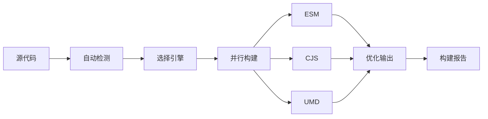

# 简介

@ldesign/builder 是一个现代化的前端库打包工具，它结合了多种打包引擎的优势，提供了极致的开发体验。

## 什么是 @ldesign/builder？

@ldesign/builder 是一个**智能的、零配置的、多引擎的**前端库打包工具。它能够：

- 🎯 **自动检测**项目类型和框架
- ⚡ **极速构建**，支持 4 种打包引擎
- 📦 **零配置**，开箱即用
- 🔧 **全框架支持**，覆盖 13 种主流框架
- 🚀 **并行构建**，提速 2.5 倍
- 💾 **智能缓存**，增量构建更快

## 核心特性

### 🎯 零配置优先

90% 的项目无需任何配置即可开始构建：

```bash
# 仅需两步
pnpm add @ldesign/builder -D
npx ldesign-builder build
```

自动完成：
- ✅ 检测项目类型（Vue/React/TypeScript...）
- ✅ 查找入口文件
- ✅ 生成多种格式（ESM + CJS + UMD）
- ✅ 生成类型声明
- ✅ 优化代码体积

### ⚡ 极致性能

支持 4 种打包引擎，根据场景选择：

| 引擎 | 速度 | 适用场景 |
|------|------|----------|
| **esbuild** | 10-100x | 开发环境，快速迭代 |
| **swc** | 20x | 生产环境，平衡速度和体积 |
| **rollup** | 1x | 生产环境，最优化输出 |
| **rolldown** | 5-10x | 现代化，未来趋势 |

### 🔧 全框架支持

自动检测并配置 13 种框架：

**现代框架**
- Vue 3 / Vue 2
- React
- Svelte
- Solid / SolidStart
- Preact

**新兴框架**
- Qwik
- Lit
- Angular
- Astro
- Nuxt 3
- Remix

**通用**
- TypeScript
- Vanilla JS

### 🚀 并行构建

同时生成多种格式，提速 2.5 倍：

```bash
# 串行构建（传统方式）
ESM: 10s → CJS: 10s → UMD: 10s = 30s

# 并行构建（@ldesign/builder）
ESM + CJS + UMD = 12s  ✨
```

### 💾 智能缓存

三层缓存策略，显著提升重复构建速度：

- **L1 内存缓存** - 最快，100ms 响应
- **L2 磁盘缓存** - 快速，500ms 响应  
- **L3 分布式缓存** - 团队共享（可选）

### 🎨 开发体验

- **友好的错误提示** - 清晰的错误信息和解决方案
- **完整的构建报告** - 可视化 HTML 报告
- **实时性能分析** - 找出构建瓶颈
- **丰富的插件生态** - 官方和社区插件

## 工作原理



### 1. 自动检测

扫描项目文件，检测：
- 项目类型（package.json、依赖分析）
- 框架类型（Vue/React/Svelte...）
- 入口文件（约定优于配置）
- 输出需求（从 package.json 推断）

### 2. 智能配置

根据检测结果生成最优配置：
- 选择合适的打包引擎
- 配置框架特定的插件
- 设置输出格式和目录
- 优化选项（Tree-shaking、Minify）

### 3. 并行构建

多进程并行构建不同格式：
- 充分利用多核 CPU
- 独立的构建上下文
- 共享依赖分析结果

### 4. 输出优化

- 代码压缩（Terser/esbuild/swc）
- Tree-shaking（移除未使用代码）
- 代码分割（可选）
- 生成类型声明

## 与其他工具对比

### vs Rollup

| 特性 | @ldesign/builder | Rollup |
|------|------------------|--------|
| 配置复杂度 | 零配置 | 需要详细配置 |
| 构建速度 | ⚡ 10-100x（可选 esbuild） | 🐢 基准速度 |
| 框架支持 | ✅ 自动检测 | ⚠️ 需要手动配置 |
| 并行构建 | ✅ | ❌ |

### vs Vite

| 特性 | @ldesign/builder | Vite |
|------|------------------|------|
| 目标场景 | 📦 库打包 | 🌐 应用开发 |
| 零配置 | ✅ | ✅ |
| 多格式输出 | ✅ ESM/CJS/UMD | ⚠️ 主要 ESM |
| 类型声明 | ✅ 自动生成 | ⚠️ 需要配置 |

### vs tsup

| 特性 | @ldesign/builder | tsup |
|------|------------------|------|
| 打包引擎 | 4 种可选 | 仅 esbuild |
| 框架支持 | 13 种，自动检测 | 基础支持 |
| 配置灵活性 | ✅ 高度灵活 | ⚠️ 相对简单 |
| Monorepo | ✅ 原生支持 | ❌ |

## 适用场景

### ✅ 适合

- **组件库** - Vue/React 组件库
- **工具库** - 通用 JS/TS 工具库
- **Monorepo** - 多包项目
- **开源项目** - 需要多格式输出
- **企业项目** - 需要稳定性和性能

### ⚠️ 不太适合

- **应用开发** - 推荐使用 Vite/Next.js
- **纯配置项目** - 如果有非常特殊的配置需求

## 系统要求

- **Node.js** - >= 16.0.0
- **npm/pnpm/yarn** - 任意包管理器
- **操作系统** - Windows/macOS/Linux

## 浏览器支持

输出代码默认支持：

- Chrome >= 64
- Firefox >= 67
- Safari >= 12
- Edge >= 79
- Node.js >= 16

可通过配置调整目标环境。

## 许可证

[MIT License](https://github.com/ldesign/builder/blob/main/LICENSE)

## 下一步

- 📖 [快速开始](/guide/getting-started) - 5 分钟上手
- 🎯 [为什么选择 Builder](/guide/why) - 深入了解优势
- 🔧 [配置文件](/guide/config-file) - 自定义配置
- ⚡ [打包引擎](/guide/bundlers) - 选择合适的引擎
